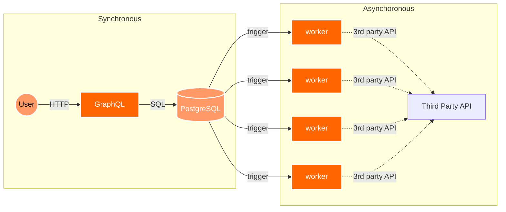

# Asynchronous Framework Demo

- [如何在架构层面解决90%的问题【让编程再次伟大#12】](https://www.youtube.com/watch?v=Y0688p1afBo)



```txt
Client ─HTTP/GraphQL─► PostgreSQL
                              │ (trigger + pg_notify)
                              ▼
                        LISTEN/NOTIFY
                              │
                 Worker(s) ───┘──► 第三方 API
```

## How to Run

1.  **Install Dependencies:**
    
    Make sure you have `uv` installed.
    
    ```bash
    uv add fastapi uvicorn "strawberry-graphql[fastapi]" asyncpg stripe streamlit python-dotenv psycopg2-binary
    ```
    
2.  **Set up PostgreSQL (Supabase):**
    
    *   Create a new project on [Supabase](https://supabase.com/).
    *   Go to the "SQL Editor" and run the script from `db/schema.sql`.
    *   In your project settings, find your database connection string.
    
3.  **Configure Environment Variables:**
    
    *   Create a `.env` file in the root of the project.
    *   Add your Supabase connection string and Stripe API key:
        
        ```
        DATABASE_URL="your_supabase_connection_string"
        STRIPE_API_KEY="your_stripe_api_key"
        ```
        
4.  **Run the Backend:**
    
    ```bash
    uvicorn app.main:app --reload
    ```
    
    The GraphQL endpoint will be available at `http://127.0.0.1:8000/graphql`.
    
5.  **Run the Worker:**
    
    In a separate terminal:
    
    ```bash
    python worker/main.py
    ```
    
6.  **Run the Frontend:**
    
    In a third terminal:
    
    ```bash
    streamlit run frontend/main.py
    ```
    
    You can now create tasks from the Streamlit interface, and you will see the worker processing them in its terminal.
