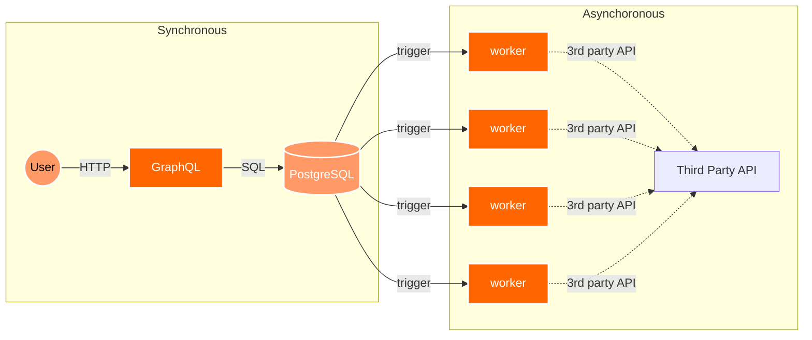

# Asynchronous Framework Demo

- [如何在架构层面解决90%的问题【让编程再次伟大#12】](https://www.youtube.com/watch?v=Y0688p1afBo)



```txt
Client ─HTTP/GraphQL─► PostgreSQL
                              │ (trigger + pg_notify)
                              ▼
                        LISTEN/NOTIFY
                              │
                 Worker(s) ───┘──► 第三方 API
```

## Todo

- [ ] Backend-end demo
- [ ] PostgreSQL (use Supabase) with trigger and notification
- [ ] Front-end to submit task using GraphQL
